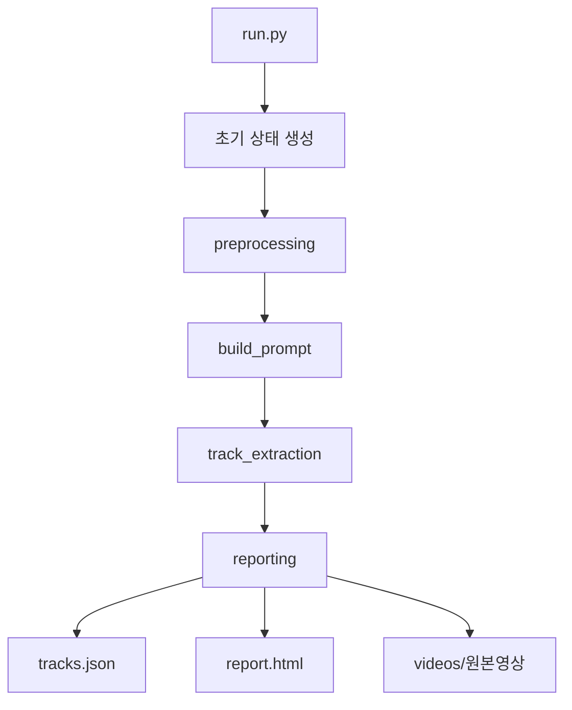

# v2t-single

비디오를 입력으로 받아 사운드 트랙 구조를 추출하고, 결과를 JSON과 HTML 보고서로 저장하는 파이프라인입니다.

현재 구현은 전체 비디오를 한 번에 분석하는 Phase 1 베이스라인에 해당합니다.

## 프로젝트 목적

이 프로젝트는 비디오를 보고 다음과 같은 정보를 구조화하는 것을 목표로 합니다.

- 전경 중심의 액션 사운드 트랙
- 배경 중심의 앰비언스 트랙
- 각 트랙의 시간 구간
- 각 트랙의 설명

결과는 사람이 검토하기 쉬운 보고서와, 후속 처리에 사용할 수 있는 JSON 형태로 저장됩니다.

## 현재 파이프라인



## 처리 흐름

### 1. preprocessing

- 비디오 경로를 확인합니다.
- 비디오 길이를 추출합니다.
- 필요 시 작업용 비디오를 준비합니다.
- 분석에 사용할 입력 정보를 정리합니다.

### 2. build_prompt

- 설정값에 따라 사용할 프롬프트 프로파일을 선택합니다.
- 시스템 프롬프트와 유저 프롬프트를 생성합니다.
- 비디오 길이를 프롬프트에 반영합니다.

### 3. track_extraction

- 전체 비디오를 기준으로 사운드 트랙을 추출합니다.
- `action_tracks`와 `background_tracks`를 생성합니다.
- 같은 사운드는 여러 구간으로 나뉘어도 하나의 트랙으로 유지하고 `segments`로 정리합니다.
- 각 트랙에는 `track_id`가 부여됩니다.

### 4. reporting

- 결과를 `tracks.json`으로 저장합니다.
- 비디오와 타임라인이 함께 보이는 `report.html`을 생성합니다.
- 공유를 위해 원본 비디오를 결과 폴더 안에 함께 저장합니다.

## 프로젝트 구조

```text
.
├── clients/
│   └── gemini_client.py
├── pipeline/
│   ├── graph.py
│   ├── reporting.py
│   ├── schema.py
│   ├── state.py
│   └── nodes/
│       ├── build_prompt.py
│       ├── preprocessing.py
│       └── track_extraction.py
├── prompts/
│   ├── single_audio.py
│   └── single.py
├── tools/
│   └── video_utils.py
├── config.py
├── config.yaml
├── run.py
├── rebuild_report.py
└── README.md
```

## 환경 설정

### uv 설치

```bash
curl -LsSf https://astral.sh/uv/install.sh | sh
source $HOME/.local/bin/env
```

### 의존성 설치

프로젝트 루트에서 가상환경과 의존성을 준비합니다.

```bash
uv sync
```

### 환경 변수 설정

`.env` 파일에 API 키를 설정합니다.

```bash
GEMINI_API_KEY=your_gemini_key
LANGCHAIN_TRACING_V2=true
LANGCHAIN_API_KEY=your_langsmith_key
LANGCHAIN_PROJECT=v2t-single
```

## 실행

단일 비디오 실행:

```bash
uv run python run.py --video videos/your_video.mp4
```

디렉토리 내 여러 영상 실행:

```bash
uv run python run.py --video videos/
```

하위 디렉토리까지 재귀적으로 실행:

```bash
uv run python run.py --video videos/ --recursive
```

## 출력 결과

단일 비디오 실행 결과는 `results/<run_id>/` 아래에 저장됩니다.

예시:

```text
results/20260512_202444/
├── report.html
├── tracks.json
└── videos/
    └── your_video.mp4
```

디렉토리 입력으로 여러 영상을 실행한 경우에는 입력 디렉토리의 최하위 이름으로 상위 폴더를 만들고, 그 아래에 각 run 결과를 저장합니다.

예시:

```text
results/videos/
├── 20260512_202444_your_video_01/
│   ├── report.html
│   ├── tracks.json
│   └── videos/
│       └── your_video_01.mp4
└── 20260512_202512_your_video_02/
    ├── report.html
    ├── tracks.json
    └── videos/
        └── your_video_02.mp4
```

### `tracks.json`

다음과 같은 구조화 결과를 담습니다.

- 입력 메타데이터
- 추출된 트랙 정보
- 트랙 설명
- 시간 구간 정보

### `report.html`

다음 내용을 시각적으로 확인할 수 있습니다.

- 비디오 재생
- 트랙 목록
- 시간 구간 타임라인
- 재생 위치와 동기화된 playhead

## 보고서만 다시 생성하기

이미 `tracks.json`이 있으면, 전체 파이프라인을 다시 돌리지 않고 보고서만 재생성할 수 있습니다.

```bash
uv run python rebuild_report.py --input results/<run_id>/tracks.json
```

## 현재 범위

현재 구현은 다음 범위에 집중합니다.

- 전체 비디오 단일 분석
- 비디오당 gemini 호출 1회
- 같은 사운드를 동일 track으로 생성 (track내 segments로 관리)
- 결과 보고서 생성

## 향후 계획

1. 프롬프트 고도화 및 멀티트랙 생성 품질 개선
2. cut 분할 도입
3. HITL 기반 결과 재배치 UI 확장
