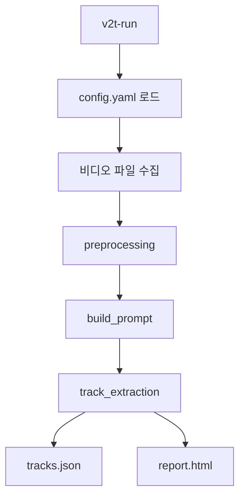
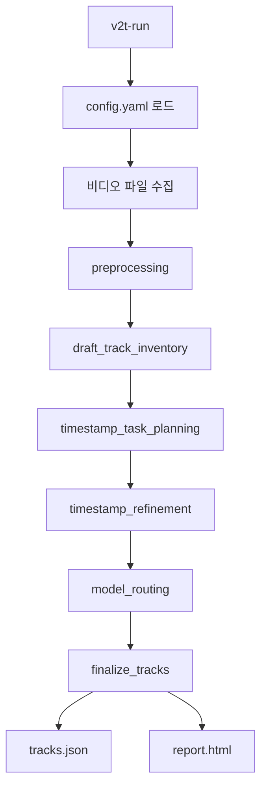
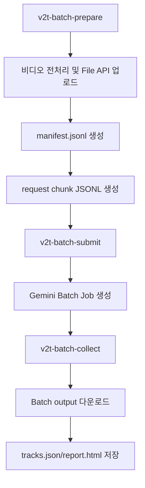

# v2t-single

비디오를 Gemini로 분석해 사운드 트랙 구조를 추출하고, 결과를 JSON과 HTML 보고서로 저장하는 파이프라인입니다.

현재는 두 가지 온라인 추론 모드를 지원합니다.

- `mode: "single"`: 전체 비디오를 한 번에 분석하는 single-call 파이프라인
- `mode: "multi"`: draft inventory, timestamp refinement, model routing, finalize를 분리한 multi-agent 파이프라인

별도로 Gemini Batch API 기반 대량 처리 워크플로우를 지원하지만, batch 경로는 아직 single-stage 요청 생성 기준입니다.

## 주요 기능

- 단일 비디오, 디렉토리, 재귀 디렉토리 입력 지원
- Gemini File API 기반 비디오 업로드
- single/multi mode 전환 지원
- `video_fps`, `multi_base_fps`, `multi_refinement_fps` 기반 video metadata 전달
- prompt profile 기반 single-call 프롬프트 선택
- structured output schema 검증
- action/background track 및 sound layer 추출
- multi-agent draft inventory 및 timestamp refinement
- T2A/V2A generation model routing 정보 생성
- JSON 결과와 HTML 보고서 저장
- multi-agent 중간 산출물 저장
- Gemini Batch API prepare/submit/collect workflow 지원
- LangSmith trace에 Gemini token usage 기록

## 처리 흐름

### Single Run



### Multi-Agent Run



### Batch Run



Batch 경로는 현재 `run_build_prompt` + 단일 JSON schema 응답을 기준으로 request를 생성합니다. multi-agent online graph를 batch로 분해하는 기능은 아직 포함되어 있지 않습니다.

## 프로젝트 구조

```text
.
├── src/
│   └── v2t_single/
│       ├── clients/
│       ├── pipeline/
│       ├── prompts/
│       ├── tools/
│       ├── batch_collect.py
│       ├── batch_prepare.py
│       ├── batch_submit.py
│       ├── config.py
│       ├── rebuild_report.py
│       ├── run.py
│       └── scene_detect_report.py
├── docs/
│   └── project-structure.md
├── config.yaml
├── langgraph.json
├── pyproject.toml
└── README.md
```

## 설치

`uv`가 없다면 먼저 설치합니다.

```bash
curl -LsSf https://astral.sh/uv/install.sh | sh
source "$HOME/.local/bin/env"
```

프로젝트 루트에서 의존성을 설치합니다.

```bash
uv sync
```

## 환경 변수

`.env.example`을 참고해 `.env`를 준비합니다.

```bash
GEMINI_API_KEY=your_gemini_key
LANGSMITH_TRACING=true
LANGSMITH_API_KEY=your_langsmith_key
LANGSMITH_PROJECT=v2t-single
```

LangSmith tracing을 사용하지 않으려면 `LANGSMITH_TRACING=false`로 설정합니다.

## 설정

기본 설정은 `config.yaml`에서 관리합니다.

```yaml
mode: "multi"
model: "gemini-3.1-pro-preview"
output_dir: "results"
temperature: 0.0
seed: 42

options:
  use_audio: false
  use_scene_detect: true
  use_hitl: false
  save_intermediate: true
  input_mode: "file_api"
  video_fps: 5
  use_sound_layering: true
  prompt_profile: "single_layering_model_routing"
  multi_base_fps: 1
  multi_refinement_fps: 10
  multi_single_event_padding_seconds: 1.5
  multi_repeated_chunk_seconds: 12.0
  multi_chunk_overlap_seconds: 0.25
  multi_timestamp_merge_tolerance_seconds: 0.10
  multi_validation_retry_count: 1
  multi_refinement_max_workers: 4
```

상위 필드:

- `mode`: `single` 또는 `multi`. `v2t-run`이 어떤 graph를 실행할지 결정합니다.
- `model`: Gemini model name. single/multi inventory/refinement 호출 모두 이 값을 사용합니다.
- `output_dir`: 결과 루트 디렉토리.
- `temperature`: Gemini generation temperature.
- `seed`: Gemini generation seed.

`options` 필드:

- `use_audio`: 현재 상태 필드로 전달되지만 실제 분기 로직은 아직 없습니다.
- `use_scene_detect`: 전처리 단계에서 PySceneDetect로 컷 경계를 추출해 prompt에 주입합니다.
- `use_hitl`: 현재 구현 범위 밖의 예약 필드입니다.
- `save_intermediate`: `true`면 intermediate JSON 산출물을 `intermediate/` 폴더에 저장합니다.
- `input_mode`: 현재 `file_api`만 지원합니다. `frames`는 아직 미구현입니다.
- `video_fps`: single online run과 batch request에서 사용하는 FPS metadata입니다.
- `use_sound_layering`: legacy 옵션입니다. 실제 프롬프트 선택은 `prompt_profile`을 기준으로 합니다.
- `prompt_profile`: single-call prompt profile입니다. multi mode에서는 사용하지 않습니다.
- `multi_base_fps`: multi mode의 draft inventory 단계에서 사용하는 저 FPS 분석 값입니다.
- `multi_refinement_fps`: multi mode의 timestamp refinement 단계에서 사용하는 고 FPS 분석 값입니다.
- `multi_single_event_padding_seconds`: `single_event` refinement window의 좌우 padding입니다.
- `multi_repeated_chunk_seconds`: `repeated_event` refinement 시 한 번에 분석할 chunk 길이입니다.
- `multi_chunk_overlap_seconds`: repeated chunk 간 overlap 길이입니다.
- `multi_timestamp_merge_tolerance_seconds`: 여러 refinement 결과 onset을 병합할 때의 허용 오차입니다.
- `multi_validation_retry_count`: draft/refinement JSON validation 실패 시 재시도 횟수입니다.
- `multi_refinement_max_workers`: timestamp refinement 병렬 호출 최대 worker 수입니다.

지원 prompt profile:

- `single`
- `single_audio`
- `single_layering`
- `single_layering_model_routing`

현재 `input_mode: "file_api"`만 지원합니다.

## 온라인 실행

`v2t-run`은 별도 `--mode` 옵션이 없고, `config.yaml`의 `mode` 값으로 동작이 결정됩니다.

현재 기본 `config.yaml`은 `mode: "multi"`입니다.

### Multi 실행

기본 설정 그대로 실행:

```bash
uv run v2t-run --video videos/your_video.mp4
```

디렉토리 입력:

```bash
uv run v2t-run --video videos/
```

하위 디렉토리까지 재귀적으로 실행:

```bash
uv run v2t-run --video videos/ --recursive
```

모델 또는 temperature를 실행 시 덮어쓰기:

```bash
uv run v2t-run \
  --video videos/your_video.mp4 \
  --model gemini-3.1-pro-preview \
  --temperature 0.0
```

### Single 실행

single mode를 쓰려면 `mode: "single"`인 별도 config 파일을 두고 실행하는 것을 권장합니다.

예시 `config.single.yaml`:

```yaml
mode: "single"
model: "gemini-3.1-pro-preview"
output_dir: "results"
temperature: 0.0
seed: 42

options:
  use_audio: false
  use_scene_detect: true
  save_intermediate: true
  input_mode: "file_api"
  video_fps: 5
  prompt_profile: "single_layering_model_routing"
```

단일 비디오 실행:

```bash
uv run v2t-run --video videos/your_video.mp4 --config config.single.yaml
```

디렉토리 내 여러 영상 실행:

```bash
uv run v2t-run --video videos/ --config config.single.yaml
```

하위 디렉토리까지 재귀적으로 실행:

```bash
uv run v2t-run --video videos/ --recursive --config config.single.yaml
```

모델 또는 temperature를 실행 시 덮어쓰기:

```bash
uv run v2t-run \
  --video videos/your_video.mp4 \
  --config config.single.yaml \
  --model gemini-3.1-pro-preview \
  --temperature 0.0
```

다른 config 파일 사용:

```bash
uv run v2t-run --video videos/your_video.mp4 --config config.yaml
```

## PySceneDetect 리포트

Gemini 호출 없이 PySceneDetect만 실행하고, 컷별 클립과 HTML 보고서를 생성합니다.

```bash
uv run v2t-scene-detect-report \
  --video samples/vggsound_test/5PYzLVpPSXA_000070.mp4
```

과분할이 보이면 더 보수적인 preset을 사용합니다.

```bash
uv run v2t-scene-detect-report \
  --video samples/vggsound_test/5PYzLVpPSXA_000070.mp4 \
  --preset conservative
```

Preset은 `high_recall`(threshold 27, min_scene_len 1), `balanced`(35, 6), `conservative`(45, 12)를 지원하며, `--threshold`, `--min-scene-len`으로 직접 덮어쓸 수 있습니다.

디렉토리 입력도 지원합니다.

```bash
uv run v2t-scene-detect-report \
  --video samples/vggsound_test \
  --max-videos 5
```

출력은 `results/scene_detect/<run_id>/<video>/report.html`, `scene_cuts.json`, `clips/cut_*.mp4`로 저장됩니다.

## Batch 실행

Batch 처리는 3단계로 나뉩니다.

주의:

- batch workflow는 현재 single-stage request generation만 지원합니다.
- `batch_prepare`는 `config.mode`를 읽지 않고 single-call prompt + `TrackOutputModel` schema 기반 request를 생성합니다.

### 1. 요청 준비

비디오 전처리, Gemini File API 업로드, manifest 및 request chunk를 생성합니다.

```bash
uv run v2t-batch-prepare \
  --video videos/ \
  --batch-name my_batch \
  --chunk-size 200
```

재귀 탐색:

```bash
uv run v2t-batch-prepare \
  --video videos/ \
  --batch-name my_batch \
  --recursive
```

테스트용 일부만 준비:

```bash
uv run v2t-batch-prepare \
  --video videos/ \
  --batch-name my_batch \
  --max-videos 10
```

기존 manifest를 재사용:

```bash
uv run v2t-batch-prepare \
  --video videos/ \
  --batch-name my_batch \
  --resume
```

### 2. Batch job 제출

생성된 request chunk를 Gemini Batch API에 제출합니다.

```bash
uv run v2t-batch-submit --batch-dir results/my_batch/batch
```

특정 chunk만 제출:

```bash
uv run v2t-batch-submit \
  --batch-dir results/my_batch/batch \
  --chunk chunk_0001
```

이미 job 파일이 있어도 다시 제출:

```bash
uv run v2t-batch-submit \
  --batch-dir results/my_batch/batch \
  --chunk chunk_0001 \
  --force-resubmit
```

### 3. Batch 결과 수집

완료된 job의 output을 내려받고, 각 비디오별 `tracks.json`과 `report.html`을 생성합니다.

```bash
uv run v2t-batch-collect --batch-dir results/my_batch/batch
```

job이 끝날 때까지 polling:

```bash
uv run v2t-batch-collect \
  --batch-dir results/my_batch/batch \
  --poll \
  --poll-interval 60
```

특정 chunk만 수집:

```bash
uv run v2t-batch-collect \
  --batch-dir results/my_batch/batch \
  --chunk chunk_0001
```

### 실패 항목 재시도

`v2t-batch-collect`가 만든 `failed.jsonl`을 이용해 retry request chunk를 만들 수 있습니다.

```bash
uv run v2t-batch-prepare \
  --batch-name my_batch \
  --resume \
  --retry-failed results/my_batch/batch/failed.jsonl
```

생성된 `retry_*.jsonl`도 `v2t-batch-submit`, `v2t-batch-collect`의 `--chunk` 옵션으로 동일하게 처리합니다.

## 출력 결과

Single 실행에서 파일 하나를 입력하면 `results/<input-file-name>/<run_id>/` 아래에 결과가 저장됩니다.

```text
results/your_video.mp4/
└── 20260518_162830_your_video/
    ├── report.html
    ├── tracks.json
    └── videos/
        └── your_video.mp4
```

디렉토리 입력은 입력 디렉토리 이름을 상위 폴더로 사용합니다.

```text
results/videos/
├── 20260518_162830_01/
│   ├── report.html
│   ├── tracks.json
│   └── videos/
│       └── 01.mp4
└── 20260518_162905_02/
    ├── report.html
    ├── tracks.json
    └── videos/
        └── 02.mp4
```

Batch 실행은 `results/<batch-name>/batch/` 아래에 batch 관리 파일을 저장하고, 각 비디오별 결과는 `results/<batch-name>/<run_id>/` 아래에 저장합니다.

```text
results/my_batch/
├── batch/
│   ├── manifest.jsonl
│   ├── requests/
│   │   └── chunk_0001.jsonl
│   ├── jobs/
│   │   ├── chunk_0001.job.json
│   │   └── index.jsonl
│   ├── outputs/
│   │   └── chunk_0001.results.jsonl
│   └── failed.jsonl
└── video_000001_your_video/
    ├── report.html
    ├── tracks.json
    └── videos/
        └── your_video.mp4
```

`tracks.json`에는 실행 메타데이터, 비디오 정보, Gemini raw JSON payload, 검증된 action/background tracks가 저장됩니다.

`report.html`에서는 비디오, 트랙 목록, sound layer, routing badge, segment timeline, 재생 위치와 동기화되는 playhead를 확인할 수 있습니다.

multi mode에서 `save_intermediate: true`이면 추가로 아래와 같은 중간 산출물이 저장됩니다.

```text
results/your_video.mp4/
└── 20260518_162830_your_video/
    ├── intermediate/
    │   ├── 01_draft_track_inventory.json
    │   ├── 02_timestamp_tasks.json
    │   ├── 03_timestamp_refined_tracks.json
    │   └── 04_routed_tracks.json
    ├── report.html
    ├── tracks.json
    └── videos/
        └── your_video.mp4
```

## 보고서 재생성

이미 생성된 `tracks.json`이 있으면 Gemini를 다시 호출하지 않고 HTML 보고서만 재생성할 수 있습니다.

```bash
uv run v2t-rebuild-report --input results/<path-to-run>/tracks.json
```

출력 경로 지정:

```bash
uv run v2t-rebuild-report \
  --input results/<path-to-run>/tracks.json \
  --output results/<path-to-run>/report.html
```

## LangSmith Tracing

`src/v2t_single/clients/gemini_client.py`의 Gemini 호출 helper는 LangSmith `traceable(run_type="llm")`로 감싸져 있습니다. Gemini 응답의 `usage_metadata`를 LangSmith usage schema로 변환해 trace에 기록합니다.

- single mode: `generate_structured_response`
- multi mode: `generate_json_response`를 inventory/refinement 단계에서 반복 호출

LangSmith cost 표시에는 아래 값이 사용됩니다.

- `ls_provider`: `google_genai`
- `ls_model_name`: 실행 모델명
- `usage_metadata.input_tokens`
- `usage_metadata.output_tokens`
- `usage_metadata.total_tokens`

LangSmith 웹 UI에서 cost가 보이려면 pricing map에 해당 provider/model 조합이 매칭되어야 합니다. 매칭되지 않으면 token usage는 남지만 cost가 비어 있을 수 있습니다.

현재 batch collect 경로는 Gemini Batch API 결과를 로컬 산출물로 변환하며, online 호출처럼 LangSmith LLM run을 직접 생성하지는 않습니다.

## 개발 메모

- `.env`, `videos/`, `results/`, `samples/`는 git에 포함하지 않습니다.
- `use_scene_detect`가 켜져 있으면 PySceneDetect로 모델 입력 전에 cut id/start/end를 추출해 Gemini user prompt와 결과 JSON에 기록합니다.
- `use_hitl`, `input_mode: "frames"`는 설정 필드는 있지만 현재 baseline 구현 범위 밖입니다.
- `use_sound_layering`은 legacy 옵션이며, 실제 프롬프트 선택은 `prompt_profile`을 우선 사용합니다.
- multi mode의 routing 규칙은 layer 단위 `timing_strategy`, `timing_confidence`, `sync_sensitivity`, onset density를 기준으로 `t2a`/`v2a`를 결정합니다.
- batch workflow는 아직 multi-agent graph를 지원하지 않습니다.
